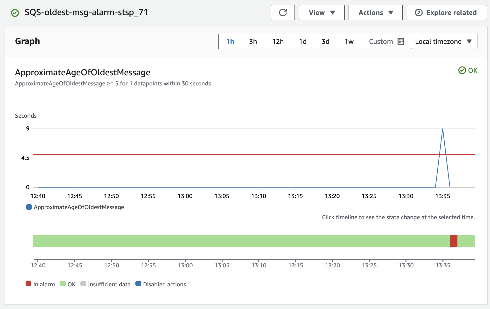
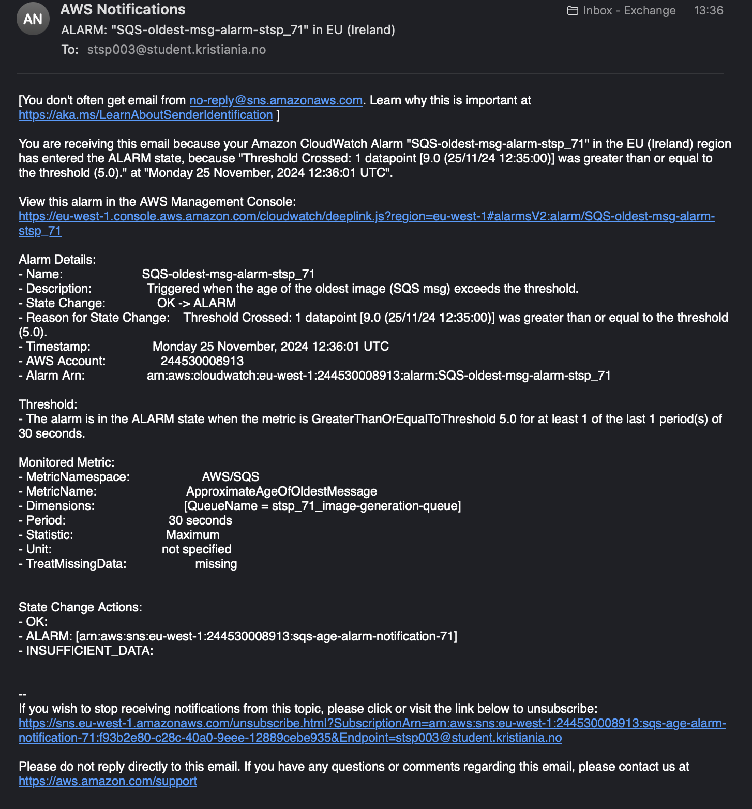

## **1. a**
Endpoint for lambda function:
```
    https://anfubt0ib8.execute-api.eu-west-1.amazonaws.com/Prod/generate-image/
```

Prompt for postman:   
```json
    
        {
            "prompt": "myself on top of pyramid"
        }
```
## **1. b**

The url for the GitHub actions with my SAM deploy (latest one) : 

```
    https://github.com/SSpvse/DevOps_Exam/actions/runs/12001128919/job/33451206622
```

## **2. a & b**

SQS - queue url:
```
    https://sqs.eu-west-1.amazonaws.com/244530008913/stsp_71_image-generation-queue
```
Using terminal to prompt the lambda functon using my queue:
```
    aws sqs send-message --queue-url https://sqs.eu-west-1.amazonaws.com/244530008913/stsp_71_image-generation-queue --message-body "me on top of the pyramid"
```

The one with push to "main" branch , with terraform apply:
```
    https://github.com/SSpvse/DevOps_Exam/actions/runs/12001128921
```

The one with push to "terraPlan" branch, with terraform plan:

```
    https://github.com/SSpvse/DevOps_Exam/actions/runs/12010894405
```

## **3. a**

**Tagging Docker Images:**

In my .github/workflows/docker_deploy.yml file, I tag Docker images with two tags: latest and the short SHA code of the matching GitHub actions commit.

```
    latest Tag: Ensures that the most up-to-date version of my code is always accessible with a consistent tag, simplifying deployment and testing processes.
```
```
    SHA Code Tag: Associates the Docker image with a specific commit in GitHub. This provides traceability, making it easy to connect a Docker image to the exact code version that generated it.
```

## **3. b**

My docker images:
```
    sspvse/sqs-client
```

SQS URL:

```
    https://sqs.eu-west-1.amazonaws.com/244530008913/stsp_71_image-generation-queue

```
Container image + SQS URL:
```
    docker run -e AWS_ACCESS_KEY_ID=xxx -e AWS_SECRET_ACCESS_KEY=yyy -e SQS_QUEUE_URL=https://sqs.eu-west-1.amazonaws.com/244530008913/stsp_71_image-generation-queue sspvse/sqs-client:latest "me on top of a pyramid"
```

## **4**

I made threshold to be 5 seconds for testing, but threshold can be altered in `infra/variables.tf` along with the e-mail for notifications.

Here it is showcasing the threshold being exceeded:


And here is my email i recieved:



## **5.1**

### **Automation & Continuous Delivery (CI/CD)**

_What it is_:

CI/CD involves automating the steps of code integration, testing, and deployment. 
This enables fast and reliable delivery of software by ensuring that changes are automatically integrated and deployed to production without having to do it manually.

**Microservices**:

    pros: 
        - Centralized pipelines simplify testing, building, and deploying multiple microservices.
        - Deployment strategies like blue-green deployments (where you run the old and new versions at the same time before switching) or rolling updates (gradually updating parts of the system) work well.
        - Simplifies version controlling for related services, because each services usually represents a well-defined and self contained unit.

    Cons:
        - Managing multiple services increases pipeline complexity, requiring more configurations and monitoring.
        - If one service update depends on another, it can slow down deployments.
        - Requires careful dependency management (API contracts between services).
        - Rolling back changes is harder when services rely on each other.

**Serverless**:
    
    Pros:
        - Individual functions are small, making it easy to deploy and test them independently without deploying the entire system.
        - Auto-scaling and deployment are managed by the provider.
        - Continuous delivery is simpler because each function can have its own lightweight pipeline.

    Cons:
        - With many small functions, pipelines can become fragmented and harder to manage.
        - If several functions depend on each other, updating them all at once can be hard to coordinate.
        - Monitoring the deployment process can be more complex because of the number of independent components.
## **Observability** 

_What it is_:

Observability involves tracking and understanding system behavior with: logging, metrics, and tracing. 
It's essential for debugging and maintaining system health.

**Microservices**:

    Pros:
        - Centralized logging and monitoring (like ELK stack that we were shown in microservices class) allows visual representation of data on one spot.
        - Easier to trace requests across services using distributed tracing.
        - You control how you collect and store your data, which means you can customize it for your needs.
    
    Cons:
        - More complex to set up and maintain centralized monitoring systems, requiring experts if its a big task.
        - If you have many services, the amount of logs and metrics can grow very quickly, making them harder to manage.
        - Requires additional tools and configuration for tracing between services.

**Serverless**:

    Pros:
        - Cloud providers like AWS automatically collect logs and metrics for your functions. 
          You get data like how many times a function was used, how long it ran, and if there were any errors, so you don’t need to set it up yourself.        
        - Fewer components to track compared to microservices, as the provider handles much of the infrastructure.
        - Since serverless functions are smaller, it’s usually easier to understand their performance & functionality on their own.
    
    Cons:
        - Logs and metrics are scattered across many functions, so it’s harder to see the big picture of how your system is working.
        - You can’t see into the servers running your functions, which makes it harder to figure out why something is slow or broken.
        - Limited visibility into underlying infrastructure, making debugging and troubleshooting difficult, such as Lambda processing messages from SQS 

## **Scalability & Cost-control**

_What it is_:

Scalability refers to the ability of a system to handle increased load by adjusting its resources. 
Cost control involves optimizing resource usage to avoid unnecessary expenses.

**Microservices**:

    Pros:
        - You can scale individual services based on how much traffic they get, so you don’t waste resources.
        - Containers or Virtual machines can be scaled as needed, with predictable costs.
    
    Cons:
        - Infrastructure and orchestration tools (like Kubernetes) add complexity.
        - Scaling requires manual setup, like configuring the number of servers or containers, which takes time and expertise.
        - Scaling might involve managing multiple instances and dependencies across services.
        - Higher costs for infrastructure maintenance, especially when not all services are fully utilized.

**Serverless**:

    Pros:
        - It automatically scales based on the number of requests. If no one is using the system, you don’t pay for it.
        - You only pay for the time your function runs and the resources it uses, which can be very cost-efficient for systems with irregular usage.
    
    Cons:
        - Costs can spike with high frequency of function invocations or inefficient function execution.
        - Harder to predict costs, especially for high-complexity or long-running functions.
        - Scaling  can be constrained by function timeout limits or execution time.
        - Serverless functions have time limits (e.g., AWS Lambda has a 15-minute max runtime), so they’re not ideal for long-running tasks.

## **Ownership & Responsibility**

_What it is_:

Ownership and responsibility in DevOps refers to the accountability of teams for ensuring application performance, reliability, and cost efficiency throughout its lifecycle.

**Microservices**:

    Pros:
        - Teams have full control over services, including performance, reliability, and scaling.
        - Easier to implement custom solutions for service interactions and error handling.
    
    Cons:
        - More operational overhead for maintaining services, databases, and scaling configurations.
        - Teams are responsible for everything, including maintaining servers and infrastructure, which takes time and effort.
        - As the system grows, it gets harder to coordinate ownership and responsibilities between teams.
        - Requires more management and intervention for uptime and fault tolerance.

**Serverless**:

    Pros:
        - The cloud provider manages much of the infrastructure, reducing operational burden.
        - Teams focus more on application logic rather than managing servers or scaling.
        - This approach works well for small teams or organizations without infrastructure experts where they can 
          focus on writing and deploying code instead of managing infrastructure.

    Cons:
        - You have less control over the underlying infrastructure, which can limit how much you can optimize performance or costs.
        - Relying on the provider means you’re affected by their reliability and any outages they have.
        - Teams must still monitor and optimize functions for cost and performance.